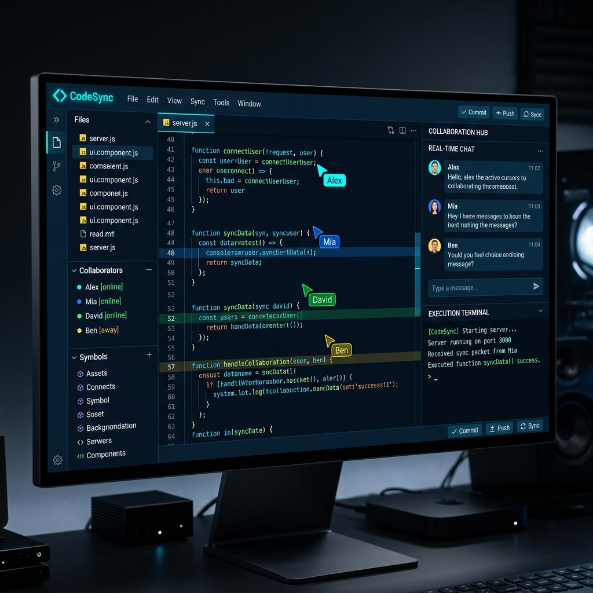
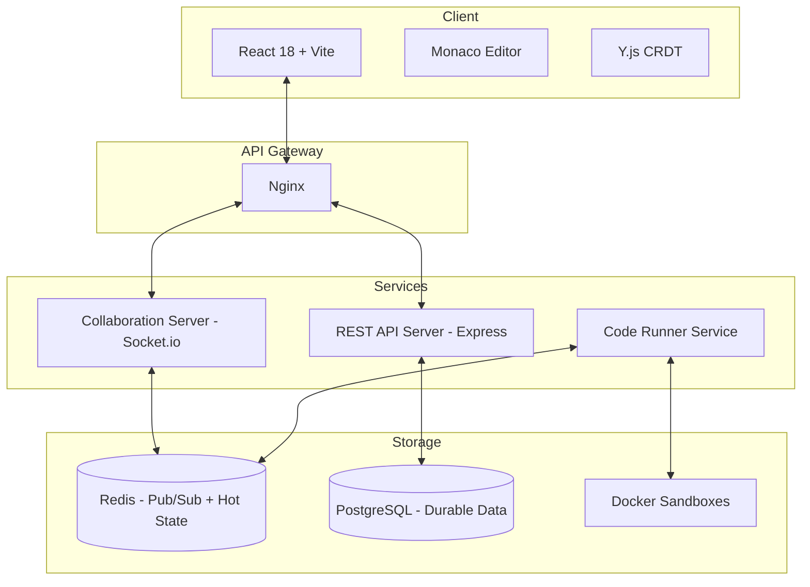

# 🚀 CodeSync — Real-Time Collaborative Code Editor



CodeSync is a production-grade, multiplayer code editing platform that combines the precision of the Monaco Editor (VS Code engine) with the real-time collaboration capabilities of Y.js. Designed for high-performance distributed environments, CodeSync features secure sandboxed code execution, live presence tracking, and a robust microservices architecture.

---

## 🧭 Project Vision

To build a developer-first collaboration tool that is resilient to network partitions, scalable to thousands of concurrent rooms, and secure against untrusted code execution. CodeSync isn't just a shared text area; it's a full-featured IDE in the browser.

---

## 📐 System Architecture

CodeSync is built as a monorepo using **Turborepo** and **pnpm**, separating concerns into specialized microservices.



---

## ✨ Key Features

### 🤝 Real-Time Collaboration (CRDTs)

- **Conflict-Free Replicated Data Types (Y.js):** Ensures eventual consistency without a central coordinator. Edits are merged seamlessly even after network outages.
- **Micro-latency Sync:** Updates are broadcasted via Socket.io with binary encoding for maximum efficiency.
- **Custom Socket.io Provider:** A bespoke implementation that integrates Y.js synchronization with our room-based authentication model.

### 👥 Presence & Awareness

- **Live Cursors:** See exactly where your teammates are typing with colored name tags.
- **Collaborator Stack:** Visual presence indicators for all active users in a room.
- **Remote Selections:** Highlighted code blocks show what others are focusing on.

### 🛡️ Secure Code Execution

- **Docker Isolation:** Code runs in air-gapped, resource-limited Docker containers.
- **Multi-Language Support:** First-class support for JavaScript, Python, and TypeScript.
- **Streaming Output:** Stdout and Stderr are streamed back to the client in real-time as the code executes.
- **Hardened Sandboxes:** Enforcement of CPU, memory, and time limits to prevent resource exhaustion and malicious attacks.

### 🕒 Revision History & Autosave

- **Two-Tier Saving:** Rapid state persistence in Redis (Hot) and periodic full snapshots in PostgreSQL (Durable).
- **Point-in-Time Restore:** View historical versions of your code and restore them with a single click.
- **Conflict-Aware Restoration:** Restoring history uses Y.js transactions to ensure all clients stay in sync.

---

## ⚙️ Tech Stack

| Layer         | Technology                              |
| ------------- | --------------------------------------- |
| **Frontend**  | React 18, Vite, Monaco Editor, Zustand  |
| **Backend**   | Node.js, Express, Socket.io             |
| **Real-Time** | Y.js (CRDT), Redis (Pub/Sub)            |
| **Database**  | PostgreSQL 16, Drizzle ORM              |
| **Execution** | Docker, BullMQ                          |
| **Monorepo**  | Turborepo, pnpm                         |
| **Tooling**   | TypeScript (Strict), Vitest, Playwright |

---

## 🗂️ Project Structure

```text
codesync/
├── apps/
│   ├── web/              # React frontend (Vite + Monaco)
│   ├── collab-server/    # WebSocket + Y.js sync service
│   ├── api-server/       # REST API (Auth, Rooms, Snapshots)
│   └── runner-service/   # Sandboxed code execution engine
├── packages/
│   ├── shared-types/     # Shared TypeScript interfaces & Socket events
│   └── ui/               # Shared Design System (CSS Modules)
├── infra/
│   ├── docker/           # Docker Compose & Sandbox images
│   └── nginx/            # Reverse proxy configuration
└── turbo.json            # Build pipeline configuration
```

---

## 🚀 Getting Started

### Prerequisites

- **Node.js:** >= 20.0.0
- **pnpm:** >= 8.0.0
- **Docker & Docker Compose**

### Installation

1. **Clone the repository:**

   ```bash
    git clone https://github.com/Ebendttl/CodeSync.git
    cd CodeSync
   ```

2. **Install dependencies:**

   ```bash
   pnpm install
   ```

3. **Set up Environment Variables:**
   Copy `.env.example` to `.env` in each app directory:
   - `apps/api-server/.env`
   - `apps/collab-server/.env`
   - `apps/runner-service/.env`
   - `apps/web/.env`

4. **Spin up Infrastructure:**

   ```bash
   docker compose -f infra/docker/docker-compose.yml up -d
   ```

5. **Run Development Server:**
   ```bash
   pnpm dev
   ```

The application will be available at `http://localhost:80`.

---

## 🔑 Engineering Decisions (The "Why")

- **Why Y.js?** Unlike Operational Transformation (OT), CRDTs don't require a central server to transform every operation, making the system more resilient and easier to scale horizontally.
- **Why Docker for Execution?** VM-based isolation is too slow for "Run" button latency. Docker containers with `--network none` and strict resource limits provide the perfect balance of speed and security.
- **Why Drizzle ORM?** We wanted the performance of raw SQL with the type-safety of TypeScript. Drizzle's zero-runtime overhead was the clear winner.
- **Why Socket.io Clustering?** By using the Redis adapter, we can scale the collaboration server horizontally, allowing thousands of users to be distributed across multiple instances.

---

## 📜 License

Distributed under the MIT License. See `LICENSE` for more information.

---

<div align="center">
  <sub>Built with ❤️ by the CodeSync Team</sub>
</div>
